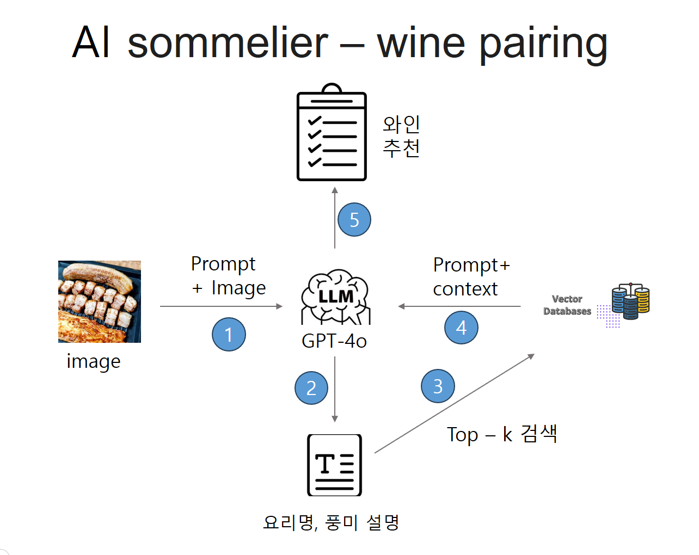

# rag_pjt
rag를 활용한 pjt


# 설치 라이브러리
```
- langchain rag 관련 lib
pip install -qU python-dotenv
pip install -qU langchain langchain-community langchain-openai
pip install langchain_pinecone

- LCEL chain 그래프로 시각화 lib
pip install -qU grandalf

- 웹앱 관련 lib
pip install fastapi
pip install "uvicorn[standard]"
```

# 웹앱 실행
```
python app_start.py
```

